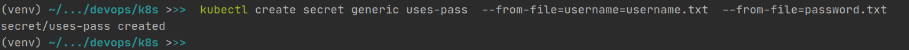
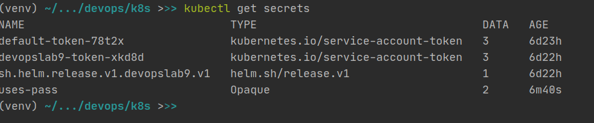
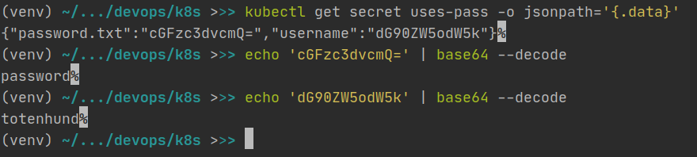
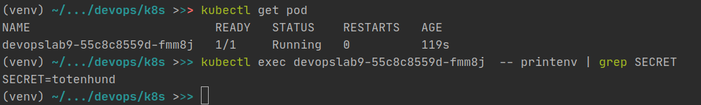
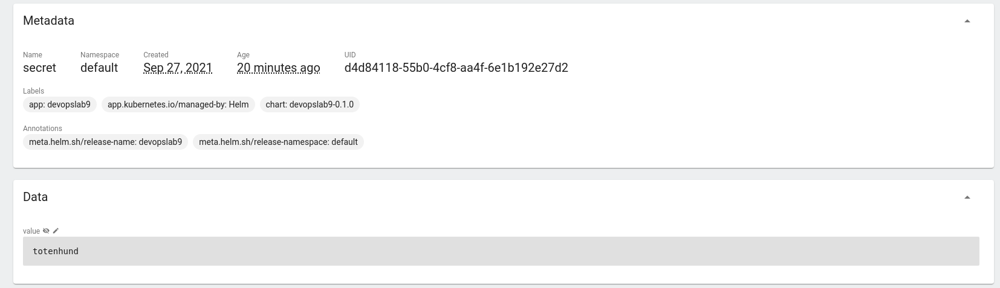
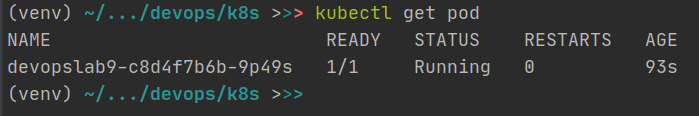

Created secret object from text files:



Listing my secret:



Decode my secret:



Upgrade pod to check secrets:

```helm upgrade devopslab9 ./devopslab9```



Final check in dashboard:



Added limits to values.yaml in resources

```
resources:
  limits:
    cpu: 100m
    memory: 128Mi
  requests:
    cpu: 100m
    memory: 128Mi
```

Check if it works after adding limits:

