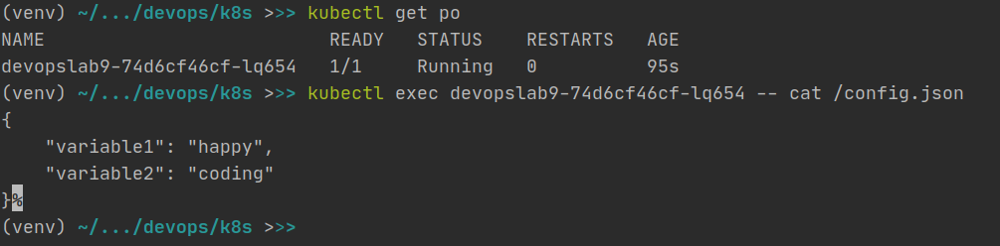

1. I created ConfigMap manifest and used ```.Files.Get``` for getting data from config.json

2. After that I updated values and deployment files, created config.json
    1. config.json contains variables ```variable1 = happy``` and ```variable2 = coding``` 
    2. In deployment I added Volumes and VolumeMounts for mounting config.json to pod   

Check your config map inside pod:

```kubectl exec POD_NAME -- cat /config.json```

