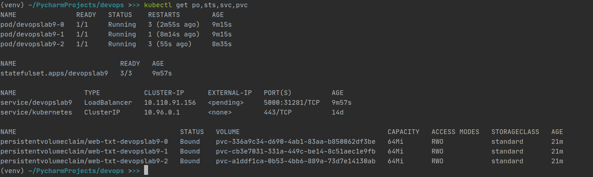

### 13 lab: StatefulSet

    1. Renamed deployment.yml to statefulset.yml
    2. Changed values to remove errors, removed secrets and config from last lab
    3. Added values such as mount path to values.yaml and used these variables in statefulset.yml

```helm package devopslab9``` - to apply changes

```helm install devopslab9 ./devopslab9-0.1.0.tgz``` - install new changes

### Output of ```kubectl get po,sts,svc,pvc```



Conclusion: All pods are running and everything is fine 

Run website
```minicube service devopslab9```

### Checking all pods


Here we can see that all pods have different values. These values are different because pods have different volumes (local files) and when we access the website random or less loaded pod is allocated for our web app.


### Ordering

In our case ordering is not needed because these pods are not connected to each other. There is no communication between pods. 