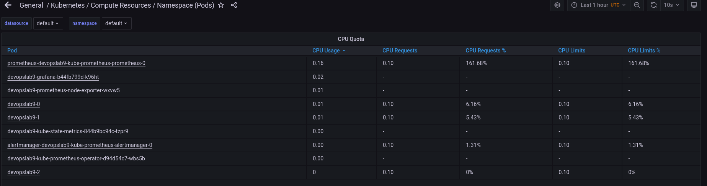

### Lab 14

#### The Prometheus Operator:

Used for configuration of Prometheus in Kubernetes. It simplifies deploying and managing Prometheus with Kubernetes. 

#### Prometheus:

It is tool which is used for monitoring and collecting metrics of application

#### Alertmanager:

It is tool for handling alerts from client. Example: Prometheus. It can send these alerts as email to the correct reciever. 

#### Prometheus node-exporter:

It collects metrics from OS (kernel-related metrics) and hardware about kubernetes nodes 

#### Prometheus Adapter for Kubernetes Metrics APIs:

The Prometheus adaptor allows us to utilize Prometheus metrics. We can use them to make scaling decisions. 

#### kube-state-metrics:

Collects metrics from all Kubernetes nodes served by Kubelet via the Summary API

#### Grafana:

Graphical visualization of all our metrics. It is easy to check them with Grafana

1) Update Chart.yaml by adding ```kube-prometheus-stack``` as dependency 
2) Build dependencies with ```helm dependency build devopslab9 ```
3) After that start minikube and install updates
4) Check by ```kubectl get po,sts,svc,pvc,cm``` 

As output we have information about all pods, services, congigmaps, statefulsets and persistent volumes in our cluster

```                                                                                             ±[●●●][master]
NAME                                                         READY   STATUS    RESTARTS      AGE
pod/alertmanager-devopslab9-kube-prometheus-alertmanager-0   2/2     Running   0             5m32s
pod/devopslab9-0                                             1/1     Running   2 (57s ago)   5m52s
pod/devopslab9-1                                             1/1     Running   0             5m50s
pod/devopslab9-2                                             1/1     Running   2 (48s ago)   5m50s
pod/devopslab9-grafana-b44fb799d-k96ht                       2/2     Running   0             5m53s
pod/devopslab9-kube-prometheus-operator-d94d54c7-wbs5b       1/1     Running   0             5m53s
pod/devopslab9-kube-state-metrics-844b9bc94c-tzpr9           1/1     Running   0             5m53s
pod/devopslab9-prometheus-node-exporter-wxvw5                1/1     Running   0             5m53s
pod/prometheus-devopslab9-kube-prometheus-prometheus-0       2/2     Running   0             5m31s

NAME                                                                    READY   AGE
statefulset.apps/alertmanager-devopslab9-kube-prometheus-alertmanager   1/1     5m32s
statefulset.apps/devopslab9                                             3/3     5m53s
statefulset.apps/prometheus-devopslab9-kube-prometheus-prometheus       1/1     5m31s

NAME                                              TYPE           CLUSTER-IP       EXTERNAL-IP   PORT(S)                      AGE
service/alertmanager-operated                     ClusterIP      None             <none>        9093/TCP,9094/TCP,9094/UDP   5m32s
service/devopslab9                                LoadBalancer   10.98.85.237     <pending>     5000:30007/TCP               5m53s
service/devopslab9-grafana                        ClusterIP      10.98.43.166     <none>        80/TCP                       5m53s
service/devopslab9-kube-prometheus-alertmanager   ClusterIP      10.110.108.210   <none>        9093/TCP                     5m53s
service/devopslab9-kube-prometheus-operator       ClusterIP      10.110.207.105   <none>        443/TCP                      5m53s
service/devopslab9-kube-prometheus-prometheus     ClusterIP      10.102.15.72     <none>        9090/TCP                     5m53s
service/devopslab9-kube-state-metrics             ClusterIP      10.105.195.25    <none>        8080/TCP                     5m53s
service/devopslab9-prometheus-node-exporter       ClusterIP      10.99.232.173    <none>        9100/TCP                     5m53s
service/kubernetes                                ClusterIP      10.96.0.1        <none>        443/TCP                      6m59s
service/prometheus-operated                       ClusterIP      None             <none>        9090/TCP                     5m31s

NAME                                         STATUS   VOLUME                                     CAPACITY   ACCESS MODES   STORAGECLASS   AGE
persistentvolumeclaim/web-txt-devopslab9-0   Bound    pvc-7b77f2ae-bad7-4c23-b041-3540fc7f349e   64Mi       RWO            standard       5m52s
persistentvolumeclaim/web-txt-devopslab9-1   Bound    pvc-86f90a77-373c-49b3-b1fb-bda00e58bbd9   64Mi       RWO            standard       5m51s
persistentvolumeclaim/web-txt-devopslab9-2   Bound    pvc-d0a910ed-b6ae-4f3b-a533-688777781175   64Mi       RWO            standard       5m50s

NAME                                                                     DATA   AGE
configmap/devopslab9-grafana                                             1      5m54s
configmap/devopslab9-grafana-config-dashboards                           1      5m54s
configmap/devopslab9-grafana-test                                        1      5m54s
configmap/devopslab9-kube-prometheus-alertmanager-overview               1      5m54s
configmap/devopslab9-kube-prometheus-apiserver                           1      5m54s
configmap/devopslab9-kube-prometheus-cluster-total                       1      5m54s
configmap/devopslab9-kube-prometheus-controller-manager                  1      5m54s
configmap/devopslab9-kube-prometheus-etcd                                1      5m54s
configmap/devopslab9-kube-prometheus-grafana-datasource                  1      5m54s
configmap/devopslab9-kube-prometheus-k8s-coredns                         1      5m54s
configmap/devopslab9-kube-prometheus-k8s-resources-cluster               1      5m54s
configmap/devopslab9-kube-prometheus-k8s-resources-namespace             1      5m54s
configmap/devopslab9-kube-prometheus-k8s-resources-node                  1      5m54s
configmap/devopslab9-kube-prometheus-k8s-resources-pod                   1      5m54s
configmap/devopslab9-kube-prometheus-k8s-resources-workload              1      5m54s
configmap/devopslab9-kube-prometheus-k8s-resources-workloads-namespace   1      5m54s
configmap/devopslab9-kube-prometheus-kubelet                             1      5m54s
configmap/devopslab9-kube-prometheus-namespace-by-pod                    1      5m54s
configmap/devopslab9-kube-prometheus-namespace-by-workload               1      5m54s
configmap/devopslab9-kube-prometheus-node-cluster-rsrc-use               1      5m54s
configmap/devopslab9-kube-prometheus-node-rsrc-use                       1      5m54s
configmap/devopslab9-kube-prometheus-nodes                               1      5m54s
configmap/devopslab9-kube-prometheus-persistentvolumesusage              1      5m54s
configmap/devopslab9-kube-prometheus-pod-total                           1      5m54s
configmap/devopslab9-kube-prometheus-prometheus                          1      5m54s
configmap/devopslab9-kube-prometheus-proxy                               1      5m54s
configmap/devopslab9-kube-prometheus-scheduler                           1      5m54s
configmap/devopslab9-kube-prometheus-statefulset                         1      5m54s
configmap/devopslab9-kube-prometheus-workload-total                      1      5m54s
configmap/kube-root-ca.crt                                               1      6m44s
configmap/prometheus-devopslab9-kube-prometheus-prometheus-rulefiles-0   28     5m31s

```

#### Grafana dashboards

    1. Check how much CPU and Memory
    your StatefulSet is consuming.


    2. Check which Pod is using CPU
    more than others and which is less
    in the default namespace.



Pod which is using more CPU than others:

Prometheus - prometheus-devopslab9-kube-prometheus-prometheus-0

Pods using less:

devopslab9-2

devopslab9-kube-state-metrics-844b9bc94c-tzpr9

alertmanager-devopslab9-kube-prometheus-alertmanager-0

devopslab9-kube-prometheus-operator-d94d54c7-wbs5b

    3. Check how much memory is used on your node,
    in % and mb.


    4. Check how many pods and containers 
    actually ran by the Kubelet service.


pods: 16

containers: 25

    5. Check which Pod is using network more than others
    and which is less in the default namespace.


Pod ```prometheus-devopslab9-kube-prometheus-prometheus-0``` is using more than others

Pod ```devopslab9-0``` using least

    6. Check how many alerts you have.
    


Alerts: 7

#### Init containers
 
From [tutorial](https://kubernetes.io/docs/tasks/configure-pod-container/configure-pod-initialization/#create-a-pod-that-has-an-init-container)

```kubectl exec pod/devopslab9-0 -- cat /html/index.html```    

