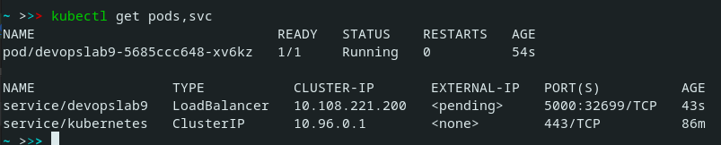
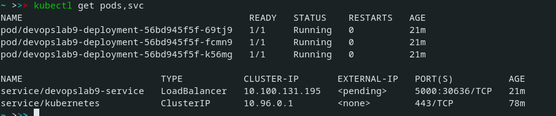

### Lab 9

#### 1st part: Deploy with terminal

I installed minikube

```
curl -LO https://storage.googleapis.com/minikube/releases/latest/minikube-linux-amd64  

sudo install minikube-linux-amd64 /usr/local/bin/minikube  
```

I installed kubectl


```
snap install kubectl --classic 
```

Minicube configuration (Profile creation) 

```
minikube start

minikube dashboard
```

Deployment of my application

```
kubectl create deployment devopslab9 --image=totenhund/devops_lab

kubectl expose deployment devopslab9 --type=LoadBalancer --port=5000
```

Command to open application

```
minikube service devopslab9
```

#### 2nd part: Deploy with .yml files

I followed these instuctions to configure my deployment.yml and service.yml:

https://kubernetes.io/docs/concepts/workloads/controllers/deployment/

https://kubernetes.io/docs/concepts/services-networking/service/


Deploy
```
kubectl apply -f deployment.yml
kubectl apply -f service.yml
```

Run to open app
```
minikube service devopslab9-service
```


#### Output of kubectl get pods,svc:

```
kubectl get pods,svc
```

1st part output



2nd part output



