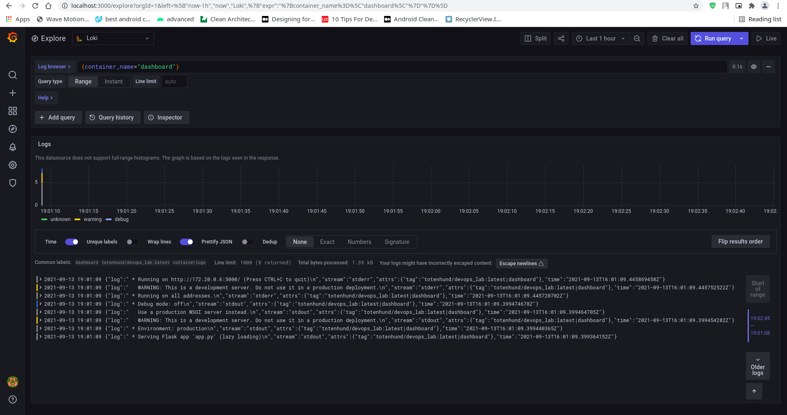
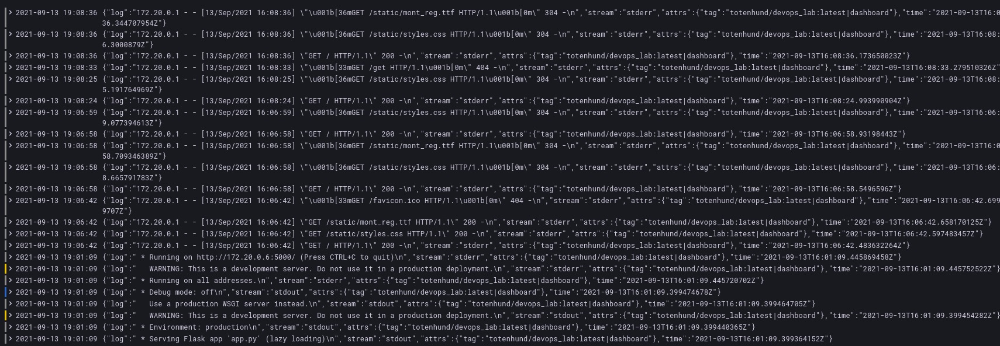

### Logging lab 7

    1.  Firstly I created docker-compose
    2.  After that I added couple of docker images that are needed (Grafana, Loki)
    3.  Pull and run docker-compose 
    4.  To see logs, I added Loki as data source [Screen 1](../screens/loki_datasource.png)
    5.  I checked that Grafana is showing some data 
    6.  I perfomed some actions on my web app and checked that logs are correct 
    
    
### Best practices
    1.  Don’t Write Logs by Yoursel
    2.  Log at the Proper Level (TRACE level, DEBUG level etc)
    3.  Employ the Proper Log Category
    4.  Write Meaningful Log Messages
    5.  Don’t Log Sensitive Information
   
